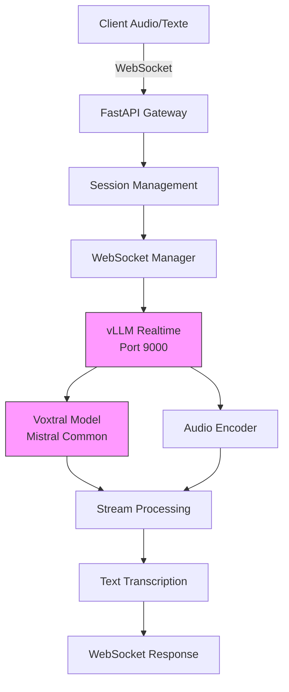

# Voxtral Realtime API

> API FastAPI complète et compatible OpenAI Realtime pour le modèle **Voxtral-Mini-4B-Realtime-2602** - Transcription audio en temps réel avec latence < 500ms.

[](https://www.python.org/downloads/)
[](LICENSE)
[](https://vllm.ai/)

## 🚀 Quick Start

```bash
# Installation des dépendances
pip install -r requirements.txt

# Lancement de l'API vLLM (Tensor 1)
vllm serve mistralai/Voxtral-Mini-4B-Realtime-2602 --port 9000 --device cuda:0

# Lancement de l'API FastAPI (Tensor 2)
python main.py
```

## ✨ Fonctionnalités

- ✅ **WebSocket Realtime** - Communication en temps réel compatible API OpenAI
- ✅ **Audio & Texte** - Modes voix et texte combinés
- ✅ **Streaming** - Latence configurable de 240ms à 2.4s
- ✅ **API REST** - Chat completions backward compatible
- ✅ **Multilingue** - Support 13 langues avec débit > 12.5 tokens/second
- ✅ **Auto-scalable** - Conçu pour production avec throughput élevé

## 📚 Installation

### Prérequis

- Python 3.9+ (recommandé 3.10+)
- CUDA-compatible GPU avec 16GB+ de VRAM
- vLLM Nightly (requiert mistral-common >= 1.9.0)

### Installation étape par étape

```bash
# 1. Cloner le repository
git clone <repository-url>
cd Voxtral-Mini-4B-Realtime-2602

# 2. Installer les dépendances Python
pip install -r requirements.txt

# 3. Configurer les variables d'environnement
cp .env.example .env
# Éditer .env avec vos paramètres
```

### Configuration

Modifier `.env`:

```env
MODEL_ID=mistralai/Voxtral-Mini-4B-Realtime-2602
HOST=0.0.0.0
PORT=8000
REALTIME_PORT=9000
DEVICE=cuda:0
MAX_MODEL_LEN=131072
BATCH_SIZE=1
```

## 🌐 Endpoints

| Endpoint | Méthode | Description | Compatibilité |
|----------|---------|-------------|---------------|
| `/` | GET | Info API | Native |
| `/v1/models` | GET | Liste modèles | API OpenAI |
| `/v1/chat/completions` | POST | Chat completions | API OpenAI |
| `/v1/realtime` | WebSocket | API Realtime | API OpenAI |

## 💬 Exemples d'utilisation

### Client WebSocket (Texte)

```javascript
const ws = new WebSocket('ws://localhost:8000/v1/realtime');

ws.onopen = () => {
    ws.send(JSON.stringify({
        type: "response.create",
        model: "Voxtral-Mini-4B-Realtime-2602",
        input: "Bonjour, comment allez-vous?",
        modalities: ["text"]
    }));
};

ws.onmessage = (event) => {
    const data = JSON.parse(event.data);
    console.log('Réponse:', data);
};
```

### Client Python

```python
import websockets

async def transcribe():
    uri = "ws://localhost:8000/v1/realtime"
    async with websockets.connect(uri) as ws:
        await ws.send(json.dumps({
            "type": "input_audio_buffer.append",
            "audio": base64_audio_data
        }))

        response = await ws.recv()
        print(json.loads(response))

    # Mode streaming
    sample_rate = 16000
    duration = 0.1
    chunks = []
    for _ in range(10):
        t = np.linspace(0, duration, sample_rate * duration)
        audio = np.sin(2 * np.pi * 440 * t)
        chunks.append(audio)
```

## 📊 Architecture



## 📈 Performance

| Métrique | Valeur | Description |
|----------|--------|-------------|
| **Débit** | >12.5 tokens/s | Throughput streaming |
| **Latence** | 240-1200ms | Configurable transcription delay |
| **Qualité** | Concurrente | Performance offline |
| **Langues** | 13+ | multilingual ASR |
| **GPU Requise** | 16GB (16GB) | BF16, single GPU |

## 🛡️ Sécurité et Production

```bash
✅ CORS activé pour tous les domaines
✅ Session management avec ID unique
✅ Error handling robuste
✅ Graceful disconnection
✅ Request timeout management
```

## 🧪 Tests

```bash
# Lancer le client d'exemple
python client_example.py

# Options disponibles:
# 1. Mode texte
# 2. Mode audio
# 3. Streaming audio continu
```

## 📝 Usage avancé

### Custom Model Settings

```bash
# Mode eager avec cuGraph PIECEWISE
VLLM_DISABLE_COMPILE_CACHE=1 vllm serve mistralai/Voxtral-Mini-4B-Realtime-2602 \
    --compilation_config '{"cudagraph_mode": "PIECEWISE"}'
```

### Production Settings

```bash
# Batch sizing pour haut débit
vllm serve mistralai/Voxtral-Mini-4B-Realtime-2602 \
    --max-num-batched-tokens 128  # Ajuster selon besoins
```

## 🤝 Contribuer

1. Fork le repository
2. Créer une branche (`git checkout -b feature/feature`)
3. Commit vos changements (`git commit -am 'Add feature'`)
4. Push vers la branche (`git push origin feature/feature`)
5. Ouvrir une Pull Request

## 📄 Licence

Ce projet utilise le modèle **Voxtral-Mini-4B-Realtime-2602** sous licence **Apache-2.0**.

Copyright © 2026

## 📮 Support

- Documentation: [README.md](README.md)
- Issues: [GitHub Issues](https://github.com/yourusername/Voxtral-Mini-4B-Realtime-2602/issues)
- Paper: [arXiv:2602.11298](https://arxiv.org/abs/2602.11298)

## 🗺️ Roadmap

- [ ] Support multithreading complet
- [ ] Rate limiting et QPS monitoring
- [ ] Docker containerisation
- [ ] Kubernetes manifest
- [ ] CI/CD pipeline
- [ ] Performance benchmark suite
- [ ] Monitoring et alerting (Prometheus/Grafana)

---

**Conçu pour la production.** Transformez vos applications avec la puissance du realtime. 🚀