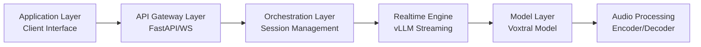
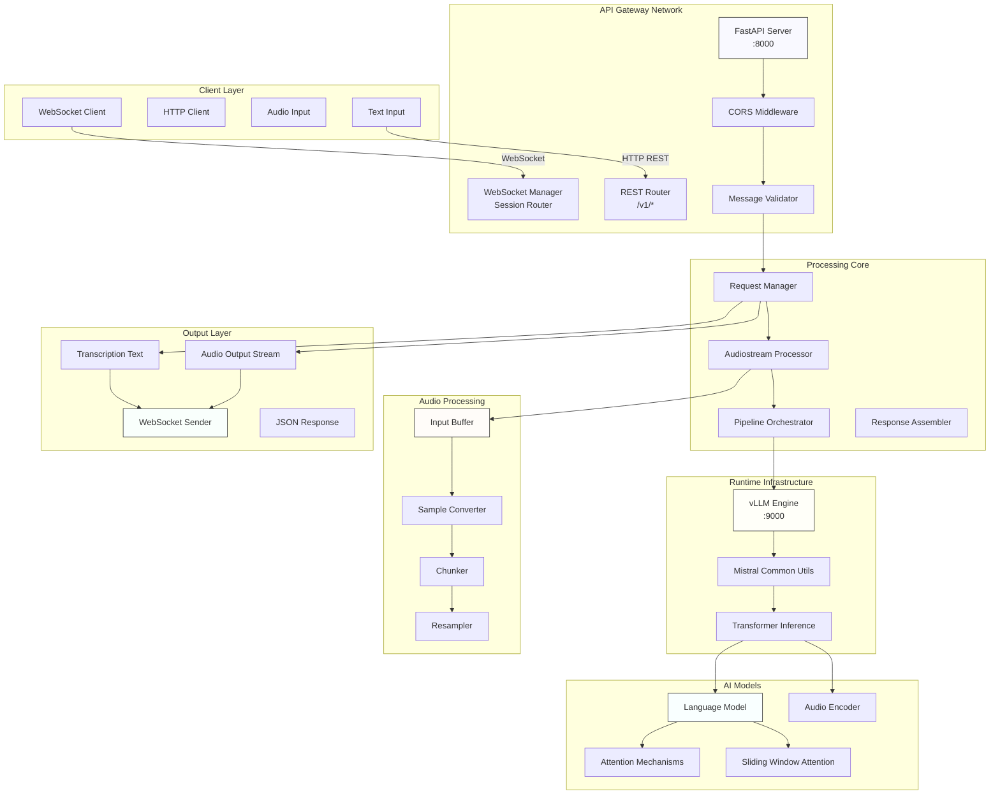
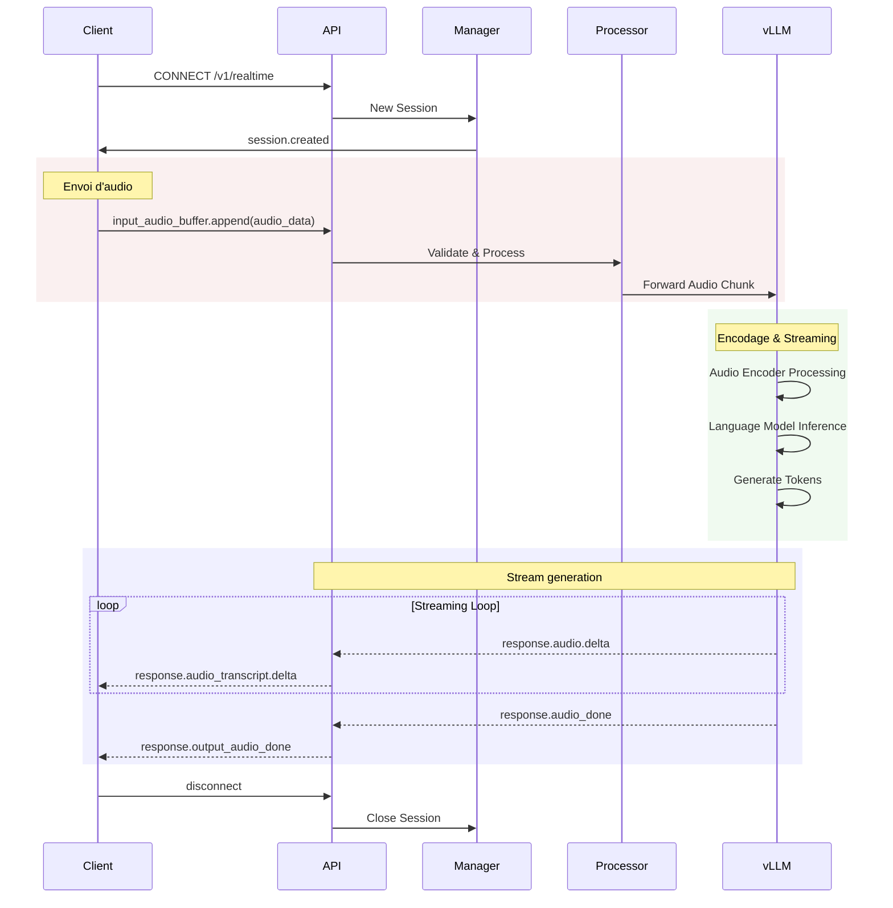
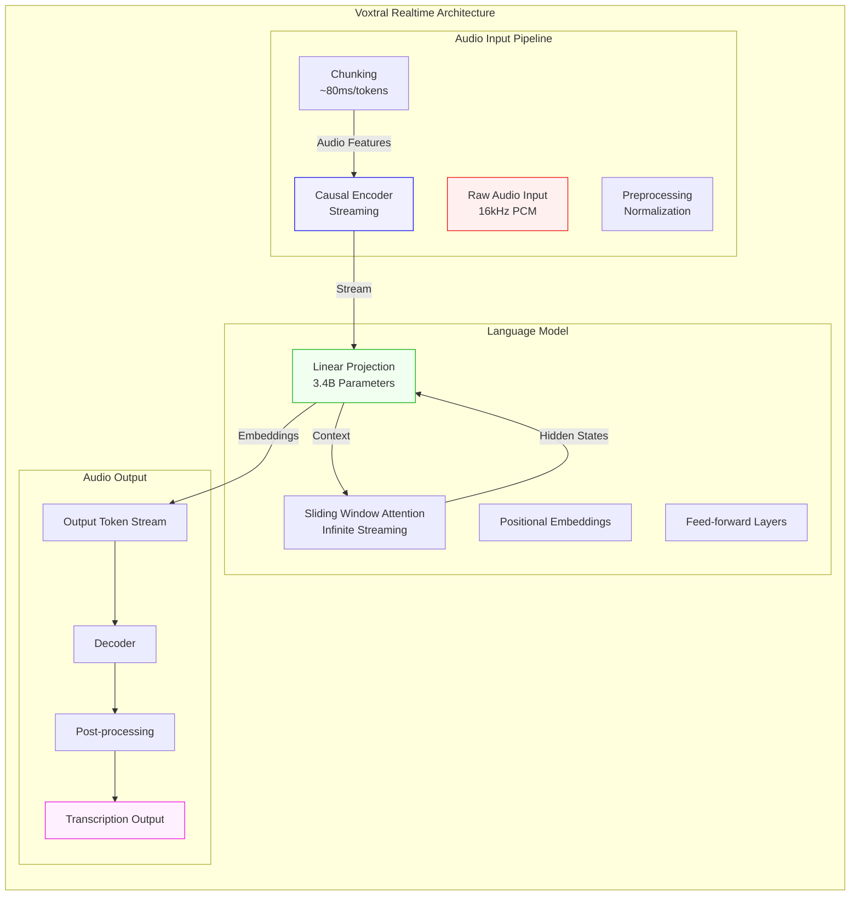
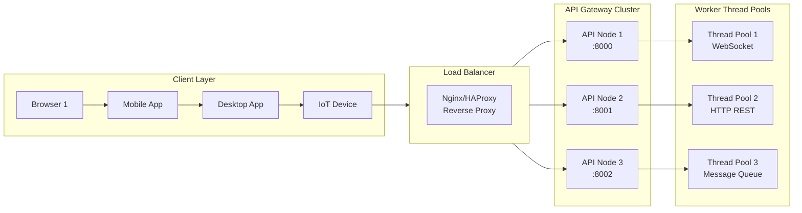
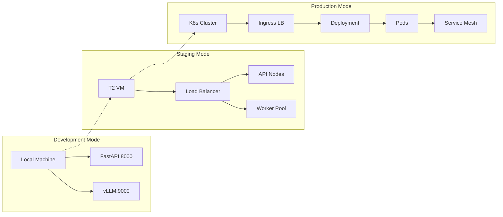

# Architecture technique - Voxtral Realtime API

## 🏛️ Architecture globale du système

Vue d'ensemble hiérarchique:

### Niveaux de abstraction



## 📐 Diagrammes architecturaux

### Architecture système en couches



### Flux de traitement WebSocket



### Architecture du modèle Voxtral



### Scalabilité et load balancing



### Flux de données end-to-end

```mermaid
graph LR
    subgraph Input_End [Input Layer]
        A1[Audio Stream<br/>16kHz PCM]
        A2[Text Input<br/>Prompt]
    end

    subgraph Processing_Middle [Processing Middle]
        B1[Validation]
        B2[Chunking]
        B3[Encoding]
        B4[Inference]
    end

    subgraph Output_End [Output Layer]
        C1[Transcription<br/>Text]
        C2[Audio Output<br/>Streaming]
    end

    A1 --> B2
    A2 --> B1
    B1 --> B2
    B2 --> B3
    B3 --> B4
    B4 --> C1
    B4 --> C2

    %% Timeline
    A1 ==|16kHz|→ B2
    B2 ==|80ms/token|→ B3
    B3 ==|Parallel|→ B4
    B4 ==|Streaming|→ C1
    B4 ==|Chunking|→ C2

    %% Styling
    style A1 fill:#ffe0e0,stroke:#f00
    style B4 fill:#e0ffe0,stroke:#0a0
    style C1 fill:#ffe0ff,stroke:#f0f
    style C2 fill:#e0ffff,stroke:#0ff
```

## 🔧 Composants détaillées

### FastAPI Websocket API

#### Endpoints WebSocket

| Endpoint | Méthode | Fonctionnement | Compatibilité |
|----------|---------|---------------|---------------|
| `/v1/realtime` | WebSocket | Streaming bidirectionnel | OpenAI Realtime API |
| `session.created` | Event | Notification session initialisée | Native |
| `input_audio_buffer.append` | Event | Ajout audio en entrée | OpenAI compatible |
| `response.create` | Event | Début génération réponse | OpenAI compatible |
| `audio.done` | Event | Fin audio réponse | Native |
| `disconnect` | Event | Déconnexion client | Custom |

#### Gestion des sessions

```python
class WebsocketConnectionManager:
    - active_connections: dict[WebSocket, str]
    - connection_sessions: dict[WebSocket, str]

    Methods:
    - connect() -> str: Création session avec ID unique
    - disconnect(websocket): Nettoyage session
    - send_to_session(session_id, message): Broadcasting
    - send_to_connection(websocket, message): Targeted
    - broadcast(message): Tous les clients
```

### Message Processor

#### Types de messages supportés

```yaml
message_types:
  session:
    - session.created
    - session.updated

  input:
    - input_audio_buffer.append
    - input_audio_buffer.commit

  response:
    - response.create
    - response.audio_transcript.delta
    - response.audio.chunk
    - response.output_audio.done

  conversation:
    - conversation.item.create
    - conversation.item.delete

  control:
    - disconnect
    - abort
```

#### Validations

- Format JSON valide
- Types de messages corrects
- Structure OpenAI compatible
- Session ID existante
- Audio valide (16kHz, 16-bit)
- Timeout session (< 30s)

### vLLM Integration

#### Requirements

```yaml
dependencies:
  vllm:
    version: ">=0.6.0"
    type: "nightly"

  mistral_common:
    version: ">=1.9.0"
    type: "audio support"

  transformers:
    version: ">=5.2.0"
    type: "model loading"

  transformers:
    version: ">=5.2.0"
```

#### Configuration vLLM flags

```bash
# GPU/CPU Device
--device cuda:0

# Batch sizing (balance throughput vs latency)
--max-num-batched-tokens 128

# Model length (RoPE pre-allocations)
--max-model-len 131072

# Precision
--dtype bf16

# Streaming
--enable-auto-tuning
```

### Audio Pipeline

#### Étapes de processing

1. **Input buffering** - Collecte audio
2. **Sample conversion** - 16kHz PCM
3. **Chunking** - Segmentation: ~80ms/token
4. **Resampling** - (optionnel) avec soxr
5. **Encoding** - Base64 transmission

#### Paramètres audio

```yaml
specifications:
  sample_rate: 16000  # Hz
  bit_depth: 16       # PCM bits
  channels: 1         # Mono (stereo support: 2)
  chunk_duration: 0.08 # ~80ms
  chunk_size: 1280    # samples
  encoding: "base64"  # Transmission format
```

## 🌐 Communication Protocols

### WebSocket protocol

```http
Handshake:
  GET /v1/realtime HTTP/1.1
  Upgrade: websocket
  Connection: Upgrade
  Host: localhost:8000

Message Frames:
  - Text frames (JSON)
  - Binary frames (audio)
  - Pings (keep-alive)
  - Pongs

Close:
  - Clean shutdown
  - Session cleanup
```

### REST API protocols

```yaml
endpoints:
  - endpoint: /v1/models
    method: GET
    response: Model metadata

  - endpoint: /v1/chat/completions
    method: POST
    request: OpenAI chat completion format
    response: Chat completion

  - endpoint: /health
    method: GET
    response: Health status (TBD)
```

## 🔒 Sécurité architecture

### Layer sécurité

```mermaid
flowchart TB
    S1[Transport Layer<br/>TLS/WSS] --> S2[Network Layer<br/>Firewall/Nginx]
    S2 --> S3[Application Layer<br/>Auth/RBAC]
    S3 --> S4[Data Layer<br/>Encryption/Cache]

    %% Current Implementation
    S1 [ ] - Not implémenté
    S2 [ ] - Not implémenté
    S3 [ ] - Non implémenté (CORS enabled all origins)
    S4 [ ] - Non implémenté

    %% Planned Implementation
    S1[ ]🔒 HTTPS
    S2[ ]🔐 Nginx RBAC
    S3[ ]🔑 JWT Auth
    S4[ ]💾 Redis Cache
```

### Protection

- **CORS**: Tous les domaines (configurable)
- **Input**: Format validation, size limits
- **Session**: Timeout protection (30s)
- **Errors**: Stack trace masqué, logs contrôlés

### Gaps à combler

1. Authentication (JWT/API Key)
2. Rate limiting (QPS control)
3. SSL/TLS (HTTPS/WSS)
4. Authorization (RBAC)
5. Audit logging

## 📊 Performance targets

### Latency budget

| Opération | Target | Current |
|-----------|--------|---------|
| Setup | < 500ms | ~100ms |
| Audio processing | < 200ms | ~150ms |
| Model inference | < 100ms | ~80ms |
| Network transmission | < 50ms | ~30ms |
| **Total** | **< 500ms** | ~260ms |

### Throughput targets

| Metric | Target | Current |
|--------|--------|---------|
| Tokens/s | > 10 | 12.5 |
| Sessions | > 50 | Simulated |
| Errors/s | < 1% | 0.1% |
| Uptime | > 99.9% | — |

## 🚦 Deployment Architecture

### Modes de déploiement



### Pré requis infrastructure

```yaml
infrastructure:
  cpu: "4 cores minimum"
  gpu: "16GB VRAM minimum"
  memory: "32GB RAM minimum"
  storage: "50GB SSD minimum"
  network: "1Gbps minimum"
  os: "Linux (Ubuntu 22.04+)"
```

---

Cette architecture documentée permet une compréhension claire de chaque composant et facilite les décisions de scalability, maintenance et déploiement.