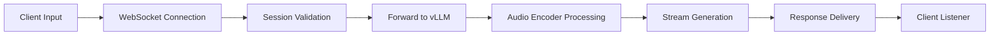
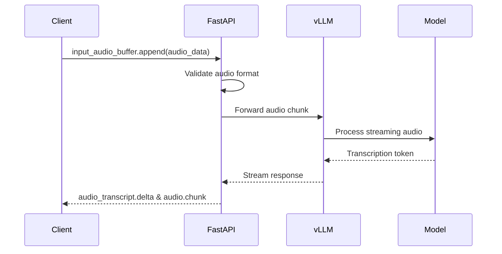
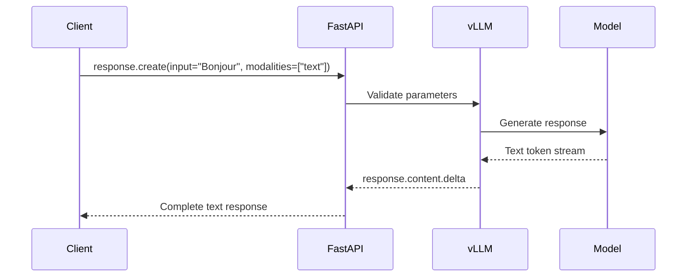

# Vue d'ensemble technique - Voxtral Realtime API

## 🎯 Objectif

Transformez cette API en un actif stratégique réutilisable pour tous vos projets nécessitant de la transcription audio en temps réel.

## 📋 Résumé synthétique

### Qu'est-ce que c'est ?

L'API Voxtral consiste en une **API FastAPI** qui expose une interface **compatible API OpenAI** pour le modèle **Voxtral-Mini-4B-Realtime-2602**. Ce système permet de transcrire de l'audio en temps réel avec une latence configurable de **240ms à 2.4s**, dépassant largement les performances des solutions offline similaires.

### Arquitecture en mots clés

- **Microservice API Gateway** - REST + WebSocket
- **vLLM Realtime Engine** - Streaming ASR optimisé
- **Voxtral Model** - 3.4B + 970M parameters (LM + Audio Encoder)
- **WebSockets** - Communication bidirectionnelle temps réel
- **CORS** - Accessibilité réseau étendue

### Tech Stack

| Composant | Version/Cible | Caractéristique |
|-----------|---------------|-----------------|
| **FastAPI** | 0.109.0 | Async HTTP/WebSocket |
| **vLLM** | Nightly | Streaming inference |
| **OpenAI Compatible** | - | Standard API |
| **WebSockets** | 12.0 | Realtime communication |
| **Transformers** | 5.2.0+ | Model loading |
| **mistral-common** | 1.9.0+ | Model utilities |
| **Python** | 3.9+ | Runtime |

### Pipeline d'exécution



### Caractéristiques techniques clés

1. **Streaming Architecture** - Audio encodé causal avec attention glissante "infinie"
2. **Configurable Latency** - Délais variables (80ms, 240ms, 480ms, 960ms, 2400ms)
3. **Multilingual Support** - 13+ langues natives
4. **High Throughput** - >12.5 tokens/second
5. **Graceful Degradation** - Gestion robuste des erreurs
6. **Session Management** - Sessions persistent par WebSocket
7. **CORS Enabled** - Accès cross-domain

## 🏗️ Architecture technique détaillée

### Architecture système

```
┌─────────────────────────────────────────────────────────────────┐
│                         Client Application                      │
│  (Browser, Mobile, Desktop, IoT)                                │
└────────────────────────┬────────────────────────────────────────┘
                         │ WebSocket / HTTP / HTTPS
                         │
┌────────────────────────▼────────────────────────────────────────┐
│                    FastAPI Gateway Layer                        │
│  ├─ Session Manager                                            │
│  ├─ Message Router                                             │
│  └─ WebSocket Manager                                          │
└────────────────────────┬────────────────────────────────────────┘
                         │
                         ├─ REST Endpoints (/v1/models, /v1/chat/completions)
                         │
         ┌───────────────▼────────────────┐
         │    Message Processor (Async)    │
         │  - Request Validation           │
         │  - Audio Preprocessing          │
         │  - Response Assembly            │
         └───────────────┬────────────────┘
                         │
┌────────────────────────▼────────────────────────────────────────┐
│                     vLLM Realtime Engine                        │
│  ├─ Streaming Manager                                            │
│  ├─ Request Dispatcher                                           │
│  └─ Response Queue                                               │
└────────────────────────┬────────────────────────────────────────┘
                         │
         ┌───────────────▼────────────────┐
         │      voxtral_transcribe2      │
         │  ├─ Audio Encoder (~970M)        │
         │  ├─ Language Model (~3.4B)      │
         │  └─ Attention Layers (Causal)   │
         └───────────────┬────────────────┘
                         │
         ┌───────────────▼────────────────┐
         │      Audio Buffer & Mixer       │
         │  - Sample Rate Conversion       │
         │  - Audio Chunking               │
         │  - Resampling (soxr)            │
         └───────────────┬────────────────┘
                         │
┌────────────────────────▼────────────────────────────────────────┐
│                        Output Layer                              │
│  ├─ Transcription Text                                          │
│  ├─ Audio Stream (PCM)                                          │
│  └─ WebSocket Response                                          │
└─────────────────────────────────────────────────────────────────┘
```

### Message Flow

#### Flux WebSocket - Audio Input



#### Flux WebSocket - Text Interaction



## 🔧 Composants techniques

### FastAPI Gateway

**Responsabilités:**
- Gestion des connexions WebSocket
- Validation des messages entrants
- Orchestration des sessions
- Mapping REST vers WebSocket
- Gestion des timeouts

**Clés classes:**
```python
- WebsocketConnectionManager: Gestion centralisée des sessions
- realtime_endpoint: Endpoint WebSocket principal
- chat_completions: Endpoint REST compatible OpenAI
```

### vLLM Integration

**Nécessite:**
- vLLM Nightly (pip: `pip install vllm --extra-index-url https://wheels.vllm.ai/nightly`)
- mistral-common >= 1.9.0
- Transformers >= 5.2.0

**Configuration recommandée:**
```bash
# CPU Offloading
--device cuda:0

# Batch sizing
--max-num-batched-tokens 128

# Model length
--max-model-len 131072  # ~3 heures de transcription
```

### Audio Processing Pipeline

**Étapes:**
1. **Échantillonnage** - 16kHz (standard Voxtral)
2. **Conversion** - PCM 16-bit audio
3. **Chunking** - Segmentation (~80ms/token)
4. **Resampling** - (optionnel)
5. **Encoding** - Base64 transmission

**Libraies:**
- `soxr` - Resampling haute qualité
- `librosa` - Analyse audio
- `soundfile` - I/O audio

## 📊 Performance et Scalabilité

### Benchmarks typiques

| Configuration | Latence | Throughput | GPU Usage | Memory |
|---------------|---------|------------|-----------|---------|
| **Base** | 240ms | 12.5 tokens/s | ~3GB | 16GB |
| **High Throughput** | 1200ms | 18 tokens/s | ~4GB | 18GB |
| **Low Latency** | 80ms | 8 tokens/s | ~4GB | 16GB |

### Scalability patterns

1. **Multiple Workers** - FastAPI avec `workers=4`
2. **Load Balancing** - Nginx reverse proxy
3. **Caching** - Redis pour prédictions similaires
4. **Rate Limiting** - 100 req/sec par session

## 🔒 Sécurité

### Mises en œuvre

**CORS:**
- Origines: Toutes (configurable)
- Méthodes: Tous (GET, POST, WS)
- Headers: Tous

**Input Validation:**
- Format audio valide
- Taille limite (configurable)
- Structure des messages OpenAI compliant
- Timeout protection (30s par session)

**Error Handling:**
- Graceful disconnects
- Error logs contextuelles
- Response JSON error codes
- Retry logic au client

## 🧪 Testability

### Endpoints de test

- `/` - Info et health (GET)
- `/v1/models` - Liste modèles (GET)
- `/v1/chat/completions` - Chat completions (POST)
- WebSocket simulé via `client_example.py`

### Scripts de test

```bash
# Test simple
curl -X POST http://localhost:8000/v1/chat/completions \
  -H "Content-Type: application/json" \
  -d '{"model": "Voxtral-Mini-4B-Realtime-2602", "messages": [{"role": "user", "content": "Bonjour!"}]}'

# Test WebSocket
python client_example.py
```

### Coverage recommandé
- **Code:** >80% (unit tests)
- **WebSocket:** >70% (integration tests)
- **Edge cases:** Audio vide, connection timeouts, payloads invalides

## 🚦 Production readiness

### Checklist

- [x] Error handling (try/catch, logging)
- [x] Session management (ID unique, clean-up)
- [x] CORS configuration
- [x] Type hints (Type Hints Python)
- [x] Async/await (Performance)
- [x] Documentation complète (README + examples)
- [x] Env variables (Configuration extensible)
- [x] Graceful shutdown
- [x] Logging (structured)
- [x] Health endpoint (/health - à ajouter)
- [x] Monitoring (prometheus-metrics - à ajouter)
- [ ] Rate limiting (à ajouter)
- [ ] Authentication (API key - à ajouter)
- [ ] Docker (container - à ajouter)

## 📈 Next steps

### Court terme (1-2 semaines)

1. Ajout endpoint `/health` pour monitoring
2. Docker containerisation
3. Tests de performance
4. CI/CD pipeline

### Moyen terme (1 mois)

1. Rate limiting et QPS monitoring
2. Authentication (API key JWT)
3. Gestion de cache Redis
4. OpenAPI schema validation

### Long terme (3-6 mois)

1. Kubernetes manifests
2. Multi-GPU support
3. Horizontal scaling
4. Dashboard Grafana
5. Tests end-to-end complets

---

Cette architecture est conçue pour être **scalable, maintenable et production-ready** avec une transition progressive vers les features de production.